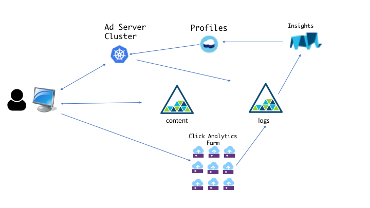

# IBM Cloud Provider - Ad Delivery Analytics sample code

The [IBM Cloud Provider](https://ibm-bluemix.github.io/tf-ibm-docs/) is a Terraform plugin that lets you provision and orchestrate IBM Cloud resources. [Terraform](https://terraform.io) is a popular opensource _infrastructure as code_ (IaC) solution supporting all the leading public cloud providers. Terraform templates describe the "to be" state of the infrastructure you want. The terraform engine takes a template and does the orchestration needed to transform the "as is" state to the "to be".

The IBM Cloud Provider supports virtual machines, load balancers, IBM Containers, Watson services, Cloudant, and more. In fact, using the provider you can create templates to provision the entire Bluemix service catalog. This article looks at how a fictitious services company uses Terraform and the IBM Cloud Provider to deliver client solutions.

## Our Scenario

JK Services is a vertical solution provider with a focus on marketing automation solutions. Their flagship solution is _ADA_, the _Ad Delivery Analytics_ application. ADA is a cloud native application that leverages IBM Watson to tailor online advertising and content delivery to website and app users. Put simply, ADA is an AI ad server.

For security and marketing reasons JK customers get their own instance of ADA when they purchase the SaaS application. Provisioning all the cloud infrastructure for even one ADA implementation was a manual, error-prone, and lengthy process. Using the IBM Cloud Provider, JK is able to provision and manage the infrastructure of each client in a repeatable and automated way. In addition, JK can be confident that each instance of the ADA application has the same infrastructure and software components.

## ADA Infrastructure



The ADA application uses a number of cloud resources:

- A _kubernetes_ cluster deployed using IBM Containers is responsible for delivering content based on a visitor's profile and preferences.
- A click handler farm of virtual machines logs all events and actions the user takes on the delivered content (_e.g. clicking on an ad_)
- The Cloudant NoSQL database is used to store visitor profile and preference information
- IBM Watson Personality Insights and IBM's BigInsigts Hadoop cluster injest the raw event logs and populate the visitor profile and preference database
- Object Storage is used for log management and for storage ad creatives and other delivered content

## ADA Templates

Using the IBM Cloud Provider, JK Services built a number of Terraform templates to automatically provision the ADA infrastructure. Let's look at different parts of their template...

### IBM Cloud Credentials

Since Terraform supports more than 50 plugin _providers_ you have to explicitly say which provider you are using and give the necessary credentials for provisioning cloud resources.

```hcl
provider "ibm" {
  bluemix_api_key = "${var.bluemix_api_key}"
  softlayer_username = "${var.softlayer_username}"
  softlayer_api_key = "${var.softlayer_api_key}"
}
```

This snippet shows the three (3) needed credentials to provision IBM Cloud resources:

- An IBM Bluemix API key
- A softlayer username
- A softlayer API key

You can use environment variables like `SL_API_KEY` to specify these credentials or you can use Terraform _variables_ like was done here. The pattern `"${var.NAME}"` is used to reference a defined variable. Here we have variables `bluemix_api_key`, `softlayer_username`, and `softlayer_api_key` defined. 

```hcl
variable "bluemix_api_key" {}
variable "softlayer_username" {}
variable "softlayer_api_key" {}
```

Variables can optionally have descriptions and default values. We'll see examples of these later.

### IBM Containers Based Kubernetes Cluster

Serving ads and content is the responsibility of an ad server. The ad server runs on a Kubernetes cluster implemented with IBM Containers and has to integrate with the profiles and preferences database. 

Here's the template definition for the ad server cluster:

```hcl
resource "ibm_container_cluster" "ad_server_cluster" {
  count        = "${var.create_ad_server}"

  name         = "ad-server-cluster-${random_id.name.hex}"
  datacenter   = "${var.datacenter}"
  org_guid     = "${data.ibm_org.org.id}"
  space_guid   = "${data.ibm_space.space.id}"
  account_guid = "${data.ibm_account.account.id}"
  no_subnet    = true
  subnet_id    = ["${var.subnet_id}"]

  workers = [
    {
      name   = "worker1"
      action = "add"
    },
    {
      name   = "worker2"
      action = "add"
    },
    {
      name   = "worker3"
      action = "add"
    },
    {
      name   = "worker4"
      action = "add"
    },
    {
      name   = "worker5"
      action = "add"
    },
  ]

  machine_type    = "${var.machine_type}"
  isolation       = "${var.isolation}"
  public_vlan_id  = "${var.public_vlan_id}"
  private_vlan_id = "${var.private_vlan_id}"
}
```

We can see that `ad_server_cluster` is specified as an [`ibm_container_cluster` resource](https://ibm-bluemix.github.io/tf-ibm-docs/v0.4.0/r/container_cluster.html). Parts of the specification are hard-coded. For example, the `workers` array specifically says this is a 5-node cluster. Other parts of the spec are based on user-supplied variables. For example, the datacenter where the cluster is deployed and the type of machine are specified using the variables `datacenter` and `machine_type` respectively.

```hcl
variable "datacenter" {
	description = "Datacenter location for the cluster"
	default = "dal12"
}
variable "machine_type" {
	description = "Cluster node machine type"
	default = "u1c.2x4"
}
```

### Integrating with the Cloudant NoSQL Database

Cloudant database instances are available as a service in the IBM Bluemix catalog. The IBM Cloud Provider uses the [service_resource](https://ibm-bluemix.github.io/tf-ibm-docs/v0.4.0/r/service_instance.html) to specify any and all Bluemix services. Describing a service just needs the name and billing information for the service:

```hcl
resource "ibm_service_instance" "profiledb" {
  name       = "profiledb-${random_id.name.hex}"
  space_guid = "${data.ibm_space.space.id}"
  service    = "cloudantNoSQLDB"
  plan       = "Lite"
  tags       = ["adserver"]
}
```

Here we are using the free ("Lite") plan for Cloudant. As stated above, specifying a Watson service like _Personality Insights_ would be exactly the same. The only difference would be the name of the service and the plan being used.


_NOTE: One of the things you might have noticed is that all resources have a name. Since JK Services is building out the same infrastructure for each customer they need to use unique names for all the resources. For example, the Cloudant database will have a name like "profiledb-A4By" because a variable `random_id` is used as a suffix on all resource names._

IBM Container clusters can use any IBM Service via a _service binding_. The service binding makes connection credentials available in the cluster's environment. The IBM Cloud Provider resource for this is aptly called [`ibm_container_bind_service`](https://ibm-bluemix.github.io/tf-ibm-docs/v0.4.0/r/container_bind_service.html).

```hcl
resource "ibm_container_bind_service" "profiledb_bind_service" {
  cluster_name_id             = "${ibm_container_cluster.ad_server_cluster.name}"
  service_instance_space_guid = "${data.ibm_space.space.id}"
  service_instance_name_id    = "${ibm_service_instance.profiledb.id}"
  namespace_id                = "default"
  org_guid                    = "${data.ibm_org.org.id}"
  space_guid                  = "${data.ibm_space.space.id}"
  account_guid                = "${data.ibm_account.account.id}"
}
```

The `profiledb_bind_service` references the cluster's name using the cluster resource directly (`${ibm_container_cluster.ad_server_cluster.name}`). The same is done for the Cloudant database service. You can reference any resource using Terraform's `${TYPE.NAME.ATTRIBUTE}` interpolation syntax.

### Planning & Applying the Template

Terraform supports two separate actions with templates: `plan` and `apply`. "Plan" is a dry run. When you do a `terraform plan` you get back a report on the resources that needed to be created, updated, or deleted based on the template definitions and the current state of the infrastructure. 

Here's a snippet from a `terraform plan` report:

```sh
~/dev/ADA $ terraform plan
Refreshing Terraform state in-memory prior to plan...
The refreshed state will be used to calculate this plan, but will not be
persisted to local or remote state storage.

data.ibm_org.org: Refreshing state...
data.ibm_space.space: Refreshing state...
data.ibm_account.account: Refreshing state...
The Terraform execution plan has been generated and is shown below.
Resources are shown in alphabetical order for quick scanning. Green resources
will be created (or destroyed and then created if an existing resource
exists), yellow resources are being changed in-place, and red resources
will be destroyed. Cyan entries are data sources to be read.

Note: You didn't specify an "-out" parameter to save this plan, so when
"apply" is called, Terraform can't guarantee this is what will execute.

+ ibm_compute_autoscale_group.sample-http-cluster
    cooldown:                                                 "30"
    health_check.%:                                           "1"
    health_check.type:                                        "HTTP"
    maximum_member_count:                                     "10"
    minimum_member_count:                                     "1"
    name:                                                     "${var.auto-scale-name}-${random_id.name.hex}"
    port:                                                     "80"
    regional_group:                                           "as-sgp-central-1"
    termination_policy:                                       "CLOSEST_TO_NEXT_CHARGE"
    virtual_guest_member_template.#:                          "1"
    virtual_guest_member_template.0.block_storage_ids.#:      "<computed>"
    virtual_guest_member_template.0.cores:                    "1"
    
    ...
```

The `terraform apply` action is what takes the as-is state of the infrastructure and transforms it to the to-be state as described by the template. The apply action can take some time depending on the number and type of resources you are provisioning.

### Summary

The full source code to the template can be found in the [IBM Cloud Schematics github repository](). Schematics is IBM's hosted _infrastructure as code_ service built on Terraform and leveraging the IBM Cloud Provider. 

Using the IBM Cloud Provider JK Services is able to specify their infrastructure using simple text file templates and leverage the Terraform engine to manage their deployment in a repeatable and automated way. The IBM Cloud Provider supports the entire Bluemix services catalog, IBM Containers, virtual machines, and other storage, compute, and network resources. [Click here](https://ibm-bluemix.github.io/tf-ibm-docs/index.html) to access the documentation set and get started today.
